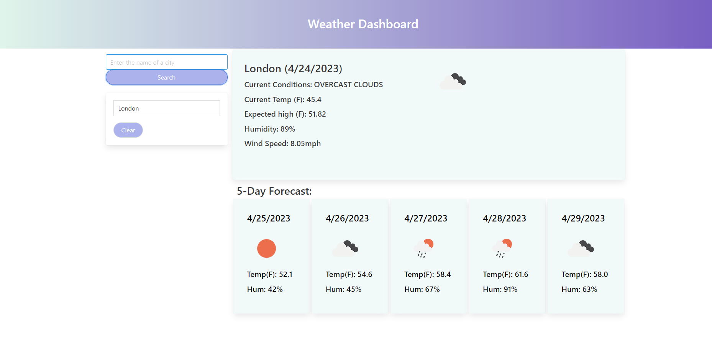

# Weather-Dashboard

## Description

For this assignment, I created a Weather Dashboard page. It shows the current temperature, expected highest temperature, humidity, and the current condition, as well as temperature and humidity predictions for the next five days. 

## Usage

To use this webpage, simply type the name of the city you want to look for in the search bar. After clicking on the search button, the results will show onscreen. You can now see that the name of the city is listed over the clear button. If you look for more cities, they will be enlisted as well. When clicking on them, the forcast for that city will display again. 
You can clear these stored cities by clicking on the Clear button. If you refresh the page, the last city you looked for will still be displayed. 

## Credit

I was helped by AskBCS Learning Assistant Shane in using my API Key correctly to retrieve the necessary data. 

## Extra notes

There seems to be an issue with the API key and sometimes it doesn't work properly, and doesn't display the weather forecast on the page as it should (shown in the screenshot).

[Weather Dashboard webpage](https://isanator2000.github.io/Weather-Dashboard/)
